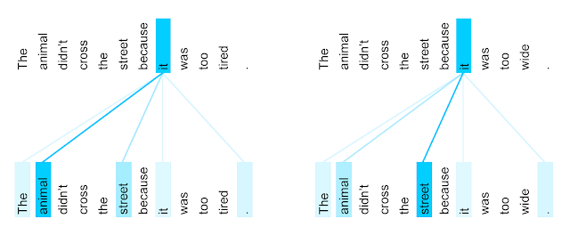
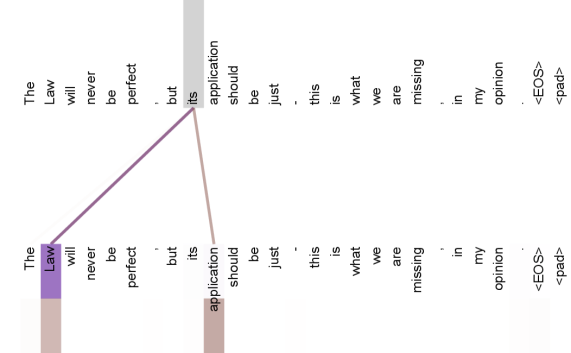

在经过英法翻译训练的 Transformer 模型中，“it”一词的编码器自注意力分布（八个注意力头之一）。

Figure 4:Two attention heads, also in layer 5 of 6, apparently involved in anaphora resolution. Top: Full attentions for head 5. Bottom: Isolated attentions from just the word ‘its’ for attention heads 5 and 6. Note that the attentions are very sharp for this word.

Figure 5:Many of the attention heads exhibit behaviour that seems related to the structure of the sentence. We give two such examples above, from two different heads from the encoder self-attention at layer 5 of 6. The heads clearly learned to perform different tasks.