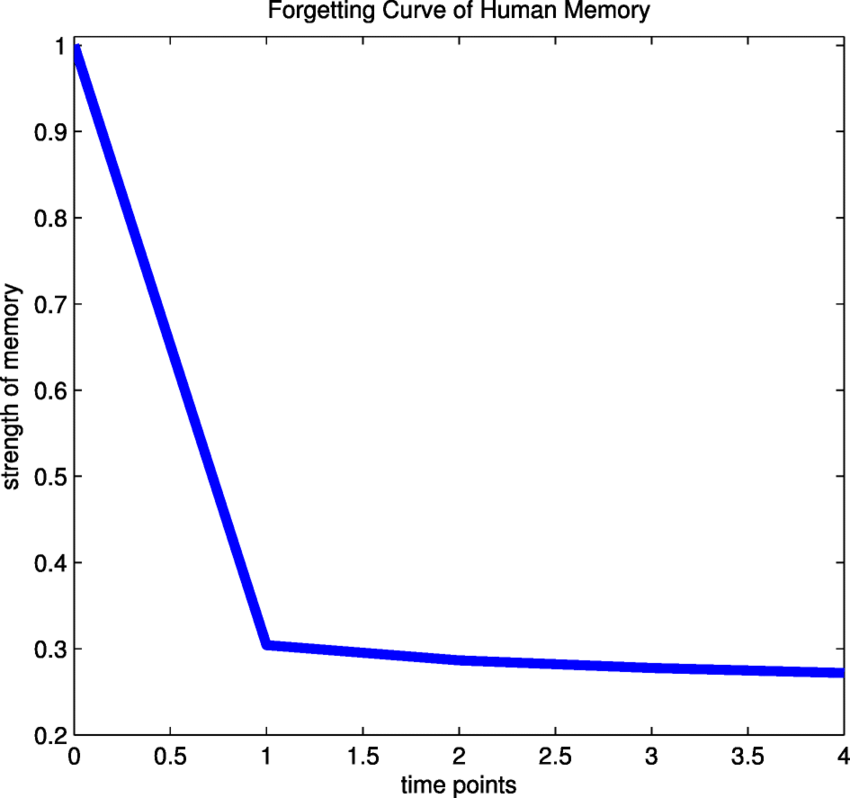

几个问题：
1. 人类记忆中的遗忘曲线最接近哪个函数，长啥样？
2. embedding 有哪些常用的实现？不同的实现对同一段文本，图像或者声音是不是生成的向量也不同？但是两个对象在向量数据库中相对的远近，关系是差不多的？
3. 这是否意味着同一个系统中最好使用某一个embedding 实现来转换对象到向量并进行添加，查询操作，从而保证一致性？
4. 一个系统如果从一个embedding 迁移到另外一个，需要注意哪些问题？最佳实践是什么？

下面逐条回答，并结合你前面关于向量数据库、RAG 等问题给出更系统性的解释。

---

# **1. 人类遗忘曲线最接近哪个函数？长啥样？**

最常引用的是 **艾宾浩斯遗忘曲线（Ebbinghaus Forgetting Curve）**。
它的数学表达并没有唯一标准，但最常用的近似形式是 **指数衰减函数** 或 **幂律衰减函数**。

---

## **(A) 指数衰减模型（最常见）**

[
R(t) = e^{-t/S}
]

* (R(t))：保持率（Retention）
* (t)：时间
* (S)：记忆强度常数（越大记得越久）

形状特点：


特点：

* 初期遗忘最快
* 随着时间推移，遗忘速度变慢

---

## **(B) 幂律衰减模型（记忆研究中更符合长期数据）**

[
R(t) = a t^{-b}
]

一些认知科学研究（如 Anderson, Schooler, 1991）认为 **幂律衰减比指数衰减更符合真实记忆的数据**，尤其长期记忆。

形状特点：


特点：

* 初期下降快，但比指数衰减更“长尾”
* 长期保留率更高

---

**结论：**

> *认知科学界普遍认为：人类记忆的遗忘曲线最接近 “幂律衰减” 或 “指数衰减”的组合模型。*
> 两个模型都是下降快 → 长尾慢。

---

# **2. embedding 的常用实现有哪些？是否生成不同向量？是否保持相对关系？**

## **常用 embedding 类型**

| 类型                  | 常见模型                                                                          | 说明            |
| ------------------- | ----------------------------------------------------------------------------- | ------------- |
| **文本 embedding**    | OpenAI (text-embedding-3), BERT, Sentence-BERT, Instructor, Cohere Embed, m3e | 用于语义搜索、检索增强。  |
| **图像 embedding**    | CLIP、OpenAI image-embedding-1、ViT                                             | 将图像映射到统一语义空间。 |
| **音频/语音 embedding** | Whisper、wav2vec 2.0、HuBERT                                                    | 用于语音识别、说话人识别。 |
| **多模态 embedding**   | CLIP、SigLip、Paligemma                                                         | 文本与图像共享向量空间。  |

---

## **不同 embedding 实现，向量是否不同？**

### **绝对会不同！**

例如同一句话：

> “I like apple.”

传给：

* BERT → 768 维向量（上下文相关）
* OpenAI embedding → 1536或3072维
* Sentence-BERT → 384或768维
* Instructor → 不同分布
* CLIP text encoder → 图像语义空间中的向量

**向量的方向、长度、分布均不一致。**

---

## **但“相对关系”是否差不多？**

部分成立，部分不成立：

### **成立的情况：**

* 同一 embedding 模型内 → 相似度有意义
* 不同模型之间 → *在同一语义组织上趋势相似（如苹果 vs 香蕉的相似度 > 苹果 vs 椅子）*

### **不成立的情况：**

* 不同 embedding 模型的向量分布、尺度、归一化方式完全不同
* 不能期望模型 A 中的「距离排序」与模型 B 完全一致
* 更不能把不同 embedding 模型生成的向量混用在同一个向量库

所以你说的：

> 两个对象在向量数据库中相对的远近关系“差不多”吗？

✔️ *大方向相似*
✖️ *但数值级别与排序未必一致，不能混用*

---

# **3. 是否意味着同一个系统里应使用同一个 embedding 实现？**

**是的，这是最佳实践。**

原因：

* 向量的分布、维度、归一化方式模型间不同
* 混用会导致：

  * 查询结果噪声大
  * 排序不稳定
  * 搜索向量范围失效
  * 模型未训练成同一语义空间，无法比较距离

> **一个系统内必须保持 embedding 模型一致性。**

如果要升级 embedding，要进行迁移（下面第 4 点）。

---

# **4. 从一个 embedding 迁移到另一个 embedding 要注意什么？最佳实践？**

迁移 embedding（Embedding Migration）是生产系统常见操作，特别是 RAG 系统。

## **要注意的关键问题**

### **(1) 不要混用旧 embedding 和新 embedding**

因为：

* 分布不一致
* 查询会异常
* recall 会下降

必须 **重算所有历史 embedding**。

---

### **(2) 检查维度变化**

如：

* text-embedding-ada-002 (1536 维)
* text-embedding-3-large (3072 维)

向量库的 schema 需要更新。

---

### **(3) 批量重嵌入（Re-Embedding）流程**

常见做法：

1. 后台任务扫描所有文档
2. 批量调用新 embedding API
3. 写入新向量库（或新 collection）
4. 回归测试
5. 完成后替换旧系统

---

### **(4) 使用“双写 + 双读 + 验证”的渐进迁移策略**

**推荐最佳实践流程：**

| 阶段              | 操作                                       |
| --------------- | ---------------------------------------- |
| 1. **双写**       | 新数据同时写入 旧 embedding 和 新 embedding        |
| 2. **双读 AB 测试** | 查询阶段对比旧的 vs 新的召回率（recall）与相关性（relevance） |
| 3. **验证**       | 人工或自动检查两个系统的结果质量                         |
| 4. **切换**       | 当新 embedding 表现更好 → 切换至新系统               |
| 5. **清理**       | 删除旧 embedding 向量库                        |

---

### **(5) 索引参数（HNSW、IVF) 也可能需要调整**

* 新 embedding 的分布会改变向量间密度
* 向量库的超参数（如 HNSW ef、m）可能要重新调优

避免 recall 下降的问题。

---

### **(6) 查询一致性处理**

迁移过程中，有两种策略：

#### **策略 A：查询阶段使用 `if old → embed_new → 查询新库`**

统一查询结果
代价：增加实时 embedding 成本

#### **策略 B：分批切换用户 / 服务**

较少实时计算成本

---

# 总结（最精简版）

| 问题                             | 答案                                         |
| ------------------------------ | ------------------------------------------ |
| **1. 遗忘曲线近似函数？**               | 指数衰减 & 幂律衰减（长期更近似幂律）。                      |
| **2. embedding 是否不同模型产生不同向量？** | 是的，不同 embedding 生成的向量、分布、坐标系完全不同。          |
| **3. 是否必须同系统用一致 embedding？**   | 是的，绝不能在同一向量库混用不同 embedding。                |
| **4. embedding 迁移需要注意？**       | 不混用、重算所有 embedding、双写双读验证、注意维度和向量库参数、谨慎切换。 |

---

如果你愿意，我可以为你画：

* 遗忘曲线函数的图
* 两个 embedding 向量空间差异示例
* embedding 迁移的系统架构图

要我一起生成吗？

===

Q: 
- embedding 中的维度设计原理和原则是什么？OpenAI embedding 上千维一般都有哪些维度？
- 向量一般是不可逆转回对象的，是吧？这是否意味着最好保存原始的对象，如文本，图像，声音等等，以备引用和以后迁移时的重算
- embedding 时将对象转为 向量，这之间有什么指标来衡量精确度或者损失度？
- 请解释 召回率（recall）与相关性（relevance）
- 请解释 向量库的超参数（如 HNSW ef, VF, m），他们对召回率（recall）与相关性（relevance）的影响，以及其在各个embedding 实现和应用场景下的经验/最佳设置值？

下面我将你的 5 个问题一次性系统回答，结合 embedding、向量数据库（HNSW/IVF）、RAG 系统的工程实践给出数学、原理与最佳实践级解释。

---

# **1. embedding 的“维度”如何设计？OpenAI embedding 上千维具体是什么？**

### ✔ 核心：**维度不是人为定义的语义标签，而是模型自动学习的隐空间特征。**

### **（A）维度的设计原理**

1. **高维向量空间能更好地表达复杂语义关系**
   高维使得模型能够：

   * 更容易区分不同概念
   * 在距离空间里更容易找出相似群集
   * 更强的表示能力（representational capacity）

2. **维度是训练过程中自动形成的**

   * 神经网络通过优化 loss，自动学习一套能最大化语义分离/聚合的坐标系
   * 每一维度 *没有* 人类可读的含义（非 one-hot、非类别）

3. **维度越高 → 能编码的语义关系越多**

   * GPT/CLIP 等大模型 embedding 一般用 768、1536、3072 维
   * 对于复杂语义场景（长文本、多语言、多模态），维度越高越好

---

### **（B）OpenAI embedding 上千维“是什么维度”？**

✔ **不是可解释维度**
✔ **不是手工命名的语义特征**
✔ **而是模型在训练语义任务时自动形成的 latent semantic coordinates**

例如 OpenAI *text-embedding-3-large（3072维）*：

* 1号维度可能编码：是否包含技术性语言
* 137号维度可能编码：情绪正负
* 2300号维度可能编码：是否涉及人物关系
* ……但这些都无法直接解释，也不稳定

**换模型就变了，换训练数据也变了。**

### 结论：

> embedding 维度 = 模型自组织出的“语义空间”，每一维无法直接解释，但整体上表达了文本/图像/音频的语义特征分布。

---

# **2. 向量一般不可逆，是否必须保存原始对象？**

### ✔ 是的，embedding 是高度不可逆的。

原因：

1. **损失信息（lossy）**
   转换为 1000+ 浮点特征 → 原始数据绝大部分细节丢失。

2. **维度远小于原始数据量**

   * 文本 3000 token → 1536 维
   * 图像百万像素 → 512 维
   * 音频几秒钟 → 256 维

3. **embedding 是压缩后的语义特征，无法重建**

→ 你无法从 embedding 重建文本、图像、音频（LLM 可能“猜”，但不是逆变换）。

---

### **这意味着：**

✔ **必须保存原始对象**
用于：

* RAG 原文引用
* 嵌入模型迁移时重新计算 embedding
* 审计和可解释性
* 用户可读内容展示
* 多模态处理（图像、音频不能逆推）

✔ **同样必须保存 metadata（id、timestamp、tags）**
向量数据库通常只存向量+少量 metadata，不适合存大文档。

### 最佳实践：

1. 文本、图像、音频 → **对象存储（S3、MinIO、本地）**
2. 向量数据库 → **只存 embedding 与 primary key**
3. 需要取内容时 → 根据 id 回到存储中取原文

---

# **3. embedding 转向量之间如何衡量“精确度 or 损失度”？**

embedding 本质是语义压缩，因此衡量标准不是“重建误差”，而是：

## ✔（A）语义相似度质量（Semantic Similarity）

* STS（Semantic Textual Similarity）评分
* 余弦相似度在相似文本间是否高？（相似度 > 0.8）
* 不相似是否低？（< 0.2）

## ✔（B）检索任务的效果

这是最关键指标。一般测：

### **1. Recall@k（召回率）**

检索时，正确的文档是否被找到？

### **2. MRR（Mean Reciprocal Rank）**

正确文档是否排在前面？

### **3. nDCG（归一化折损累积增益）**

排名越靠前得分越高。

### **4. 聚类分离度（cluster separability）**

是否把不同主题的向量聚成不同的簇？

---

# **4. 请解释：召回率（recall）与相关性（relevance）**

两者是向量搜索的核心指标。

---

## **（A）Recall（召回率）**

检索是否找到了所有相关文档？

计算：

$$ Recall@k = \frac{\text{前 k 个结果中相关文档数}}{\text{所有相关文档数}} $$

例：

* 有 10 个相关文档
* 搜索 top-5 找到其中 4 个
  → recall@5 = 4/10 = 0.4

高 recall → “找到够多吗？”

---

## **（B）Relevance（相关性 / 排名质量）**

找到的文档中，**相关的是否排在前面？**

衡量指标：

* MRR
* nDCG
* precision@k

高 relevance → “排在前面的是不是好的？”

---

### 总结：

| 指标            | 含义     |
| ------------- | ------ |
| **Recall**    | 找全了吗？  |
| **Relevance** | 排序是否好？ |

向量库的超参数主要影响 recall。

---

# **5. 向量库超参数 HNSW/IVF，它们如何影响 recall 与 relevance？如何调？**

向量数据库（如 Milvus、Qdrant、FAISS）使用 ANN（Approximate Nearest Neighbor）。

最常用两种结构：

* **HNSW（ Hierarchical Navigable Small World ）**
* **IVF（Inverted File Index）**

---

# **HNSW 参数：m、efConstruction、ef**

## **（A）m（每个节点的邻居数，degree）**

作用：

* 决定图的稠密度
* 越大 → recall 越高 → 内存越大，构建越慢

经验值：

* 16（轻量场景）
* 32（默认常用）
* 48–64（高 recall 要求）

---

## **（B）efConstruction（构建阶段的搜索宽度）**

作用：

* 越大 → 图更准确 → 构建慢

经验值：

* 100（默认）
* 200–400（高精度场景）
* 500+（SOTA recall）

---

## **（C）ef（查询时的搜索宽度）**

最关键参数。

作用：

* 越大 → recall ↑
* 搜索延迟 ↑

经验值：

* 100：速度优先
* 200：平衡（常用）
* 500：高 recall
* 1000+：接近精确搜索

---

# **IVF 参数：nlist、nprobe**

## **（A）nlist（聚类中心数）**

越大：

* 检索更精确
* 建索引时间更长
* 索引文件更大

经验值：

* 数据量 100k → nlist=256
* 数据量 1M → nlist=1024
* 数据量 >10M → nlist=4096–8192

---

## **（B）nprobe（查询时探测多少个聚类）**

越大：

* recall ↑
* 延迟 ↑

经验值：

* nprobe = 4 → 快速检索
* nprobe = 16 → 平衡
* nprobe = 64 → 高 recall

---

# **不同 embedding 大小对参数的影响**

| embedding 维度 | 推荐 HNSW m | 推荐 ef    |
| ------------ | --------- | -------- |
| 256–384 维    | 16–32     | 200–400  |
| 768–1536 维   | 32–48     | 400–800  |
| 3000+ 维      | 48–64     | 800–1500 |

维度越大 → 空间更稀疏 → 需要更高 ef 才能保持高 recall。

---

# **不同应用场景的最佳实践**

| 场景         | 优先指标                | 推荐策略                           |
| ---------- | ------------------- | ------------------------------ |
| RAG 文档检索   | recall、relevance 兼顾 | HNSW（m=32~48, ef=300–800）      |
| 聊天记忆       | recall > rank       | HNSW（ef=500+）或 IVF（nprobe=32+） |
| 推荐系统（速度关键） | latency             | 较低 m、ef、nprobe                 |
| 法律/医疗      | recall、精确度          | 最大化 m + ef，IVF nprobe 开大       |
| 千万级向量      | scalability         | IVF + HNSW hybrid              |

---

# **总总结（最精简版）**

* embedding 的维度是模型自动学出的“语义空间”，不可解释但表达能力强
* 向量不可逆 → 必须保存原始文本/图像/音频，用于引用和迁移
* embedding 精度主要衡量语义相似度与检索性能（recall/MRR/nDCG）
* recall = 找全了吗？
* relevance = 排名好吗？
* HNSW（m、ef）和 IVF（nlist、nprobe）直接影响 recall/延迟
* 维度越大 → 搜索参数要更高

---

如果你需要，我可以帮你生成：

* **可视化图：不同 HNSW 参数对 recall 的影响**
* **embedding 维度 vs 搜索难度图**
* **为你的 RAG 系统（本地 + 局域网 GPU）推荐最优向量库配置**

你需要哪一种？

===

下面我用 **最清晰、工程可直接使用** 的方式，讲解：

# ✅ 使用 sklearn 的 **TfidfVectorizer** 如何做 embedding？

先说结论：

> **TfidfVectorizer 也是一种 embedding 方法，只是传统（非神经网络）方式。**

它能把文本转换为一个 **稀疏向量（sparse vector）**，可用于：

* 文本相似度（cosine similarity）
* 信息检索（IR）
* 简单 RAG（可用，但效果不如 BERT/BGE embedding）

下面你将看到：

1. 🔍 TF-IDF embedding 原理
2. 🧪 代码示例（提取 embedding + 相似度计算）
3. ⚠️ TF-IDF embedding 的局限
4. 🆚 与 SentenceTransformer embedding 的对比（何时选哪种）

---

# 1. 🔍 TF-IDF Embedding 原理（非常简单）

`TfidfVectorizer` 不依赖模型、不需要 GPU，它把文本表示成一个非常大的词汇表空间：

* 每个维度 = 文档中出现过的某个词
* 每个值 = TF-IDF 权重（词频 × 逆文档频率）

**结果：每段文本 = 一个向量（embedding）**

例如：

```
句子 1: "我喜欢机器学习"
句子 2: "学习机器学习很有趣"
```

向量空间可能像：

| 词    | 文档1 | 文档2 |
| ---- | --- | --- |
| 我    | 1.2 | 0   |
| 喜欢   | 1.1 | 0   |
| 机器学习 | 0.8 | 1.5 |
| 有趣   | 0   | 1.0 |

每行就是一个 embedding。

---

# 2. 🧪 使用 sklearn TfidfVectorizer 生成 Embedding（最小工作代码）

## ### 基础示例：生成 embedding

```python
from sklearn.feature_extraction.text import TfidfVectorizer

docs = [
    "我喜欢机器学习和人工智能",
    "深度学习是人工智能的重要分支",
    "我最喜欢使用 Python 做机器学习"
]

vectorizer = TfidfVectorizer()
X = vectorizer.fit_transform(docs)

print("稀疏矩阵形状：", X.shape)
print("第一个文档的 embedding 向量（稀疏格式）：")
print(X[0])
```

输出类似：

```
稀疏矩阵形状： (3, 12)
(0, 5)  0.4437
(0, 8)  0.5562
...
```

说明：

* 有 3 个文档
* 12 个不同的词
* embedding 是稀疏矩阵（CSR matrix）

---

## ### 计算两个文本的相似度（TF-IDF + 余弦相似度）

```python
from sklearn.feature_extraction.text import TfidfVectorizer
from sklearn.metrics.pairwise import cosine_similarity

docs = [
    "我喜欢机器学习",
    "我喜欢深度学习"
]

vectorizer = TfidfVectorizer()
X = vectorizer.fit_transform(docs)

sim = cosine_similarity(X[0], X[1])
print("相似度 =", sim[0][0])
```

典型输出：

```
相似度 = 0.52
```

---

## ### 用 TF-IDF 做简单 RAG（非常常见）

```python
query = ["什么是人工智能的分支？"]

query_vec = vectorizer.transform(query)
scores = cosine_similarity(query_vec, X)[0]

for idx in scores.argsort()[::-1]:
    print(scores[idx], docs[idx])
```

输出会把最相关的文档排在前面。

**这就是一个简单版本的 RAG-retriever。**

---

# 3. ⚠️ TF-IDF embedding 的局限性（为什么现代 RAG 都改用 BGE / E5）

❌ **不能理解语义，只能匹配词面**
“汽车”和“车子”在 TF-IDF 中毫无关系。

❌ **不同语言无法对齐**
适用于英文/中文，但不能互通。

❌ **不能处理同义词、语义相似、推理**
“买车”和“购置车辆”相似，但 TF-IDF 向量完全不同。

❌ **向量维度非常大（上万至几十万）**
相比：

* BGE：768 维
* TF-IDF：可能 50,000+ 维（稀疏）

❌ **不适合 ANN 向量数据库（Milvus / Qdrant）**
因为稀疏向量不好做高效 ANN 检索。

---

# 4. 🆚 TF-IDF embedding vs SentenceTransformer embedding（你该什么时候用哪种？）

| 特性                     | TF-IDF | BERT/BGE/SBERT Embedding |
| ---------------------- | ------ | ------------------------ |
| 是否语义理解                 | ❌ 否    | ✅ 是                      |
| 维度                     | 上万（稀疏） | 768/1024（稠密）             |
| 是否能用向量库（Milvus/Qdrant） | 🚫 不适合 | ✅ 完美适配                   |
| 是否适合 RAG               | ⚠️ 可凑合 | ⭐ 强烈推荐                   |
| 是否适合长文本                | 差      | 好                        |
| 依赖 GPU？                | 无需     | 可不用（CPU 也行）              |
| 安装体积                   | 小      | 稍大                       |
| 速度                     | 快      | 一般                       |

### 最终建议：

* **只做本地搜索、关键词检索** → 用 TF-IDF
* **做 RAG / Agent / 语义搜索 / QA系统** → 用 BGE / E5 / GTE / m3 embedding

你现在做的 *Reflection Agent + 本地 RAG* → **绝对应该用 BGE embedding**。

---

# 📌 想要我帮你写一个完整的 **TF-IDF RAG 框架示例**？

我可以给你一套：

* 文档 chunking
* TF-IDF 向量化
* 余弦相似检索
* 使用 LLM 生成最终答案（Qwen/Ollama/GPT 均可）

非常适合你当前本地 LLAMA/Qwen 研究工作。

只需要告诉我：

你要用：

### ✔ 本地模型（Ollama?）

还是

### ✔ OpenAI / DeepSeek / Gemini API？

我可以定制一个最简洁 + 可运行的 RAG pipeline 给你。

下面逐条、专业而清晰地回答你的问题。

---

# ✅ **1. `genai.embed_content` 中 `task_type` 参数有哪些取值？**

`genai.embed_content()` 是 **Google Gemini Embeddings API（Python SDK）** 提供的接口，用于生成文本 / 图像 embedding。

不同于 OpenAI 的 `input_type`，Gemini 使用 **task_type 来告诉模型你要做哪类任务**，以便模型选择更适合的 embedding 空间。

---

## 📌 **Gemini Embeddings 可用的 `task_type` 列表（官方文档说明）**

`task_type` 目前支持以下取值（截至 2024–2025 最新 API）：

| task_type                                    | 含义                       | 用途场景                   |
| -------------------------------------------- | ------------------------ | ---------------------- |
| **"semantic_similarity"**                    | 默认；生成语义相似度 embedding     | 语义搜索 / 检索 / clustering |
| **"classification"**                         | 生成适合分类任务的 embedding      | 文本分类、标签预测              |
| **"retrieval_query"**                        | 针对 *检索查询语句* 调整 embedding | RAG 查询向量               |
| **"retrieval_document"**                     | 针对 *文档内容* 优化 embedding   | RAG 文档向量               |
| **"question_answering"**                     | 为 QA 优化向量空间              | QA 系统、问答匹配             |
| **"fact_verification"**                      | 优化事实验证空间                 | RAG rerank、证据检索        |
| **"clustering"**                             | 聚类友好                     | topic clustering       |
| **"classification"**                         | 分类稳定 embedding           | 文本分类                   |
| **"code_retrieval"**（仅 multimodal embedding） | 针对代码语义检索                 | code search            |

如果你在 `help(genai.embed_content)` 中查看，也会看到类似定义。

---

## ✨ **Gemini RAG 的推荐用法**

Google 官方推荐：

* **检索场景（RAG 查询） → 使用 `task_type="retrieval_query"`**
* **构建向量数据库（文档） → 使用 `task_type="retrieval_document"`**

它类似：

* OpenAI `text-embedding-3-large` 的 "query" / "document" 模式
* Cohere 的 embed-english-v3.0 中 query/document pair

这样能保持 *向量空间对齐*，提高 RAG 的准确率。

---

## 📌 示例代码

```python
from google import genai

client = genai.Client(api_key=...)

res = client.embed_content(
    model="models/text-embedding-004",
    content="什么是人工智能的分支？",
    task_type="retrieval_query"
)

print(res["embedding"][:10])
```

---

如果你愿意，我还能提供：

### 🔧（1）Gemini Embeddings + ChromaDB 的 RAG 示例（本地可跑）

### 🔧（2）对比 Gemini vs OpenAI 的 embedding 质量差异

### 🔧（3）结合你正在做的 Reflection Agent → 更优 Embedding 配置策略

告诉我你想进一步看哪一个？
