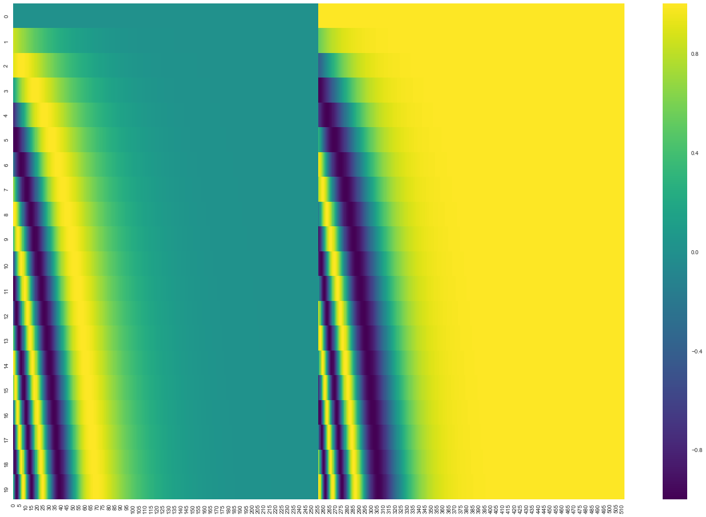

## Positional Encoding

<center>Transformer 里的正弦 / 余弦位置编码矩阵</center>

这张图基本可以看成是 **Transformer 里的正弦 / 余弦位置编码矩阵** 的可视化，只是实现时把
“前一半维度全是 sin，后一半维度全是 cos” 分开画出来了，所以中间有一条很明显的“竖分界线”。

我按“图 → 公式 → 图里每一块对应什么”来讲一遍。

---

### 1. 这张图的大致含义

* **纵轴（0–19）**：序列中的 **位置 pos**（position index），这里可见 20 行，所以是 `pos = 0…19`。
* **横轴（0–510 之类）**：embedding 的 **维度 index**，一共大约 512 维。

  * 左半边：全是 `sin(...)` 的值
  * 右半边：全是 `cos(...)` 的值
* 颜色条：

  * 紫色 ≈ -1
  * 青绿色 ≈ 0
  * 黄色 ≈ +1
    所以你会看到：
  * 第 0 行左半边几乎都是 0（青绿色）——因为 `sin(0)=0`
  * 第 0 行右半边几乎都是 1（亮黄）——因为 `cos(0)=1`

这和经典的 Transformer 位置编码公式在 `pos = 0` 时的取值完全一致。

---

### 2. 标准正余弦位置编码的公式

原始 Transformer（《Attention is All You Need》）给的公式是（假设 `d_model` 是偶数，比如 512）：

> 对于位置 (pos)（0,1,2,…）和维度索引 (i)（0,1,2,…）：

$$
\text{PE(pos, 2i)}   = \sin\left(\frac{pos}{10000^{\frac{2i}{d_\text{model}}}}\right)
$$

$$
\text{PE(pos, 2i+1)} = \cos\left(\frac{pos}{10000^{\frac{2i}{d_\text{model}}}}\right)
$$

把它拆解一下：

* **pos**：第几个 token 的位置索引（0 开始）
* **d_model**：embedding 的总维度（比如 512）
* **2i / d_model**：控制第 i 对 (sin, cos) 的“频率”
* **$10000^{2i/d_\text{model}}$**：越往右 i 越大 → 指数越大 → 分母越大
  → 角度 $\frac{pos}{\text{分母}}$ 越小 → **变化更慢**，周期更长
* 所以：

  * 左边的小维度（i 小）：频率高，随位置变化很快，呈现密集条纹
  * 右边的大维度（i 大）：频率低，随位置变化慢，看上去几乎是“渐变或者近乎常数”

---

### 3. 这张图为什么“左 sin / 右 cos 一刀切”

经典代码往往是 **偶数维放 sin，奇数维放 cos**，交错在一起，比如 PyTorch 官方实现：

```python
pe[:, 0::2] = sin(...)
pe[:, 1::2] = cos(...)
```

但你这张图更像是作者写成了类似：

```python
pe[:, :d_model//2]  = sin(... 对应一组频率 ...)
pe[:, d_model//2:]  = cos(... 对应同一组频率 ...)
```

于是：

* 横轴前一半维度：全部是 sin 曲线 → 左半块
* 横轴后一半维度：全部是 cos 曲线 → 右半块
* 在 `pos = 0` 那一行：

  * sin(0) = 0 → 左半面全是 0（青绿色）
  * cos(0) = 1 → 右半面全是 1（亮黄）

这正是你看到的 **左青右黄的第一行**。

---

### 4. 颜色条纹、弯曲带是怎么来的？

我们把“角度”记为：

$$
\theta(pos, i) = \frac{pos}{10000^{\frac{2i}{d_\text{model}}}}
$$

那么：

$$
\text{左半} = \sin(\theta(pos, i))
\quad
\text{右半} = \cos(\theta(pos, i))
$$

#### 4.1 随着 pos 向下走（同一列）

* 固定某一列（某一维度 i），从上到下看：

  * 行索引 pos 增大 → $\theta$ 增大 → sin / cos 沿着某个频率的正弦波走
  * 频率由 (i) 决定：

    * **靠左的列**：(i) 小 → 分母小 → $\theta$ 增长快 → 频率高 → 行方向出现很多交替的紫/黄条纹
    * **靠右的列**：(i) 大 → 分母巨大 → $\theta$ 变化很慢 → 在 0–19 的 pos 范围内几乎看不到完整的波，只看到一个“慢慢变色的带”或几乎一块常色区域

这就是你看到越往右，图案越“宽、越平滑”的原因。

#### 4.2 随着维度 i 向右走（同一行）

* 固定某一行（某个 pos），横向看：

  * 由于 $\theta(pos, i)$ 里分母随 i 变化是指数级，等价于不同“频率”/“波长”的 sin/cos 值拼到一起
  * 于是你会看到一串“弯曲的亮-暗带”横着扫过去，看上去像斜线（其实是多种频率正弦在这个 pos 下的截面）

特别明显的是：

* sin 半边（左）：在某些列附近，正好处在 sin 波的峰值或谷值 → 一条亮黄或深紫弧形带
* cos 半边（右）：和 sin 相差 ( \pi/2 ) 相位，所以在 pos 稍大时，cos 会出现对应的“波峰/波谷带”，和左半边错位

---

### 5. 再精确一点：行 0、行 1 的数值直觉

以 `d_model = 512` 为例，最左边 sin 列（i=0）：

$$
\theta(pos, i=0) = \frac{pos}{10000^{0}} = pos
$$

* 对 pos=0..19，这是一段 `sin(pos)`，频率相对“比较高”，下去几行就已经从 0 → 接近 1 → 回到 0 → 变成 -1 ...
* 再往右一点（i 大一点），比如 i=64：

$$
\theta(pos, i=64) = \frac{pos}{10000^{2\cdot64/512}}
$$

分母已经很大了，在 pos=0..19 范围内，$\theta$ 也许还不到 1 rad，所以 sin/ cos 都在靠近 0 或 1 的一小段范围内缓慢变化，看起来就像一个**渐变色块**。

最右边的那些列，分母巨大：

* sin(θ) ≈ θ ≈ 接近 0 → 颜色接近 0（青绿色）
* cos(θ) ≈ 1 → 颜色接近亮黄
  所以你看见了右半边最右那一大块几乎“纯黄”的区域。

---

### 6. 为啥要这么设计位置编码？

用这一堆不同频率的正余弦函数做位置编码有几个性质：

1. **任意长度序列都可以编码**
   pos 可以无限往下加，不需要学习一个固定长度的 embedding 表。
2. **线性可组合：**
   不同 pos 的编码之间有类似傅里叶基函数的关系，注意力层可以用线性组合、点积等方式，方便地表达“相对位置信息”。
3. **sin / cos 成对出现：**
   同一频率的一对 sin / cos 组合可以通过线性变换表达任意相位偏移，比如对于 pos 和 pos+δ，其对应编码在该频率上的向量可以用简单的线性变换表示，这让模型“容易学会”相对位置的偏移关系。

---

### 小结对应到你的图：

* **图的左半**：
  $\sin\big(\tfrac{pos}{10000^{2i/d}}\big)$ 值的热力图。
  行 0 全 0（青绿），越向下，出现斜着扫过的黄/紫波带。
* **图的右半**：
  $\cos\big(\tfrac{pos}{10000^{2i/d}}\big)$ 值的热力图。
  行 0 全 1（亮黄），向下逐渐出现与左边错相的波带，最右一大块几乎一直亮黄。
* **中间那条直线分界**：
  程序实现时把 sin / cos 分到 embedding 的左/右两半维度，而不是奇偶维交错，所以视觉上是一刀切。
