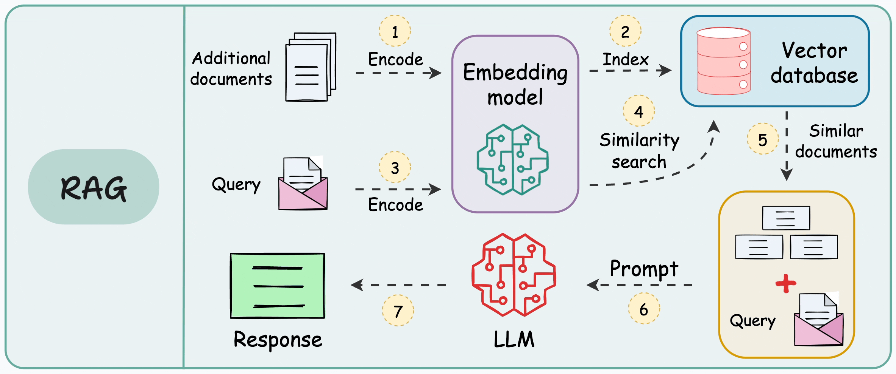

下面我给你推荐 **专为 ArchLinux + 局域网 GPU 节点（Ollama/TGI）+ 中英文检索** 的简洁可靠 RAG 技术栈，并附带最实用的安装步骤（全部本地部署、无云依赖）。

你将得到一个 **前端在 ArchLinux、本地无 GPU；后端在局域网另一台带 GPU 的机器** 的典型“分布式 RAG” 架构。

---




# ✅ 一、架构推荐（非常稳定、适合中英文 RAG）

你的场景是：

* **ArchLinux 本地机**：负责数据索引、向量库、RAG 管道
* **另一台 GPU 机器（局域网）**：运行 LLM 推理（Ollama / TGI）
* **要求支持中英文检索**

👉 推荐架构如下：

```
[ ArchLinux 本机 ]
  - LlamaIndex 或 Haystack
  - Qdrant（向量库）
  - Embedding 模型（CPU）
  - 控制 RAG Pipeline

            ↓ 通过 HTTP 调用 GPU
[ GPU 机器 ]
  - Ollama or TGI (Text Generation Inference)
  - 加速中文/英文大模型输出
```

特点：

* **GPU 节点只负责推理** → 负载更轻，CPU 主机压力最小
* ArchLinux 本地机 **不需要 GPU 也能高速生成 embedding**（用 CPU 版 bge 模型足够）
* 中英文均可用 **bge-m3** / **jina-embeddings-v2-base-zh**

---

# ✅ 二、本地（ArchLinux）推荐安装组件

## 1. **向量数据库：Qdrant（强烈推荐）**

Rust 写的，性能高、稳定、轻量。

### 安装（ArchLinux 官方仓库）：

```bash
sudo pacman -S qdrant
sudo systemctl enable --now qdrant
```

默认监听 `localhost:6333`

如果 GPU 机器也需要访问 → 修改配置 `/etc/qdrant/config.yaml`

```yaml
service:
  host: "0.0.0.0"
  port: 6333
```

---

## 2. **RAG 框架：LlamaIndex（最灵活）**

中英文都非常顺手，集成 Qdrant/TGI/Ollama 非常方便。

安装：

```bash
pip install llama-index llama-index-vector-stores-qdrant
pip install llama-index-embeddings-huggingface
```

---

## 3. **中英文 Embedding 模型（CPU 友好）**

### 推荐：

* **bge-m3**（超强中英文、小语种）
* OR：`jina-embeddings-v2-base-zh`（中文增强）

安装：

```bash
pip install sentence-transformers
```

使用 bge-m3：

```python
from sentence_transformers import SentenceTransformer
emb = SentenceTransformer("BAAI/bge-m3")
```

---

# ✅ 三、GPU 主机（局域网）推荐安装组件

## 方案 A：**Ollama（最简单、功能最完备）**

GPU 机器安装：

```bash
curl -fsSL https://ollama.com/install.sh | sh
```

启动模型（中英文通用）：

```bash
ollama pull qwen2.5:14b
ollama pull yi:9b
ollama pull llama3.1:8b
```

确认 Ollama 在监听（LAN）：

编辑 `/etc/systemd/system/ollama.service`：

```
Environment="OLLAMA_HOST=0.0.0.0"
```

然后：

```bash
sudo systemctl daemon-reload
sudo systemctl restart ollama
```

GPU 机 LLM 将暴露在：

```
http://GPU_IP:11434/api/generate
```

---

## 方案 B：**TGI（HuggingFace Text Generation Inference）**

适合模型 > 20B 或需要批处理。

Docker 示例：

```bash
docker run -d --gpus all \
  -p 8080:80 \
  ghcr.io/huggingface/text-generation-inference:latest \
  --model-id Qwen/Qwen2.5-7B-Instruct
```

服务将暴露：

```
http://GPU_IP:8080
```

---

# ✅ 四、RAG Pipeline 代码（与你的架构完美匹配）

下面是 LlamaIndex + Qdrant + 局域网 Ollama 的典型例子：

```python
from llama_index.core import VectorStoreIndex, SimpleDirectoryReader
from llama_index.vector_stores.qdrant import QdrantVectorStore
from llama_index.core import StorageContext
from llama_index.llms.ollama import Ollama
from sentence_transformers import SentenceTransformer
import qdrant_client

# 1. Embedding model (CPU)
embed_model = SentenceTransformer("BAAI/bge-m3")

# 2. Connect to Qdrant
client = qdrant_client.QdrantClient(url="http://127.0.0.1:6333")
vector_store = QdrantVectorStore(client=client, collection_name="docs")

storage = StorageContext.from_defaults(vector_store=vector_store)

# 3. Load documents
docs = SimpleDirectoryReader("data/").load_data()

# 4. Create Index
index = VectorStoreIndex.from_documents(
    docs,
    embed_model=embed_model,
    storage_context=storage
)

# 5. Connect to remote Ollama GPU node
llm = Ollama(
    model="qwen2.5:14b",
    base_url="http://192.168.1.88:11434"  # GPU node IP
)

query_engine = index.as_query_engine(llm=llm)

res = query_engine.query("请用中文解释这些文档内容的核心要点")
print(res)
```

这段代码具备：

* 本机 embedding（bge）
* 本机 Qdrant 存储
* 跨机调用 GPU LLM（Ollama）
* 中英文均可使用

你只需将数据放入 `data/` 即可。

---

# ✅ 五、推荐的整体部署方式（稳定、简单）

### **本机（ArchLinux）：**

```
sudo pacman -S qdrant
pip install llama-index
pip install sentence-transformers
```

### **GPU 机：**

```
ollama pull qwen2.5:14b
export OLLAMA_HOST=0.0.0.0
```

### 总结图：

```
ArchLinux CPU ------------------> GPU Server
Embedding (bge)                 Ollama/TGI
Qdrant vector store             Large model inference
RAG orchestration               Fast generation
```

你会得到一个：

✔ 完全本地、无云
✔ 支持中英文
✔ 高性能
✔ 可扩展
✔ 低耦合

的 RAG 系统。

---

# 如果你愿意，我可以进一步帮你生成：

* 一键安装脚本（for ArchLinux）
* 一键安装脚本（for GPU 节点）
* RAG API 服务（FastAPI）模板
* 目录结构（data/index/logs/models）建议
* docker-compose 版本
* LlamaIndex 与 Haystack 的对比选择

你想继续吗？


先直接回答结论版，再给你一点「怎么选 + 怎么搞 qdrant-bin」的具体操作。

---

## 1. LlamaIndex vs Haystack：怎么选？

结合你现在的场景：

* Arch 本机跑 RAG、Qdrant、embedding
* 局域网里另一台 GPU 跑 Ollama/TGI
* Python 为主，个人/小规模项目，先做起来，再考虑复杂 pipeline

### 核心差异（超简化版本）

| 方面           | LlamaIndex                         | Haystack                                     |
| ------------ | ---------------------------------- | -------------------------------------------- |
| 定位           | “数据接入层 + RAG 引擎”                   | “LLM 应用/Agent 编排框架 + RAG”                    |
| 上手难度         | 较低，API 偏「即插即用」                     | 偏工程化，需要理解 Pipeline 节点、组件                     |
| 文档类型支持       | 各种 Loader 特别多，PDF/HTML/DB/Notion 等 | 也支持，但更强调搜索/QA 场景                             |
| 向量库集成        | 对 Qdrant/Chroma/Weaviate 等适配很好     | 对 Elasticsearch / OpenSearch / Qdrant 等适配也不错 |
| Agent / 多步流程 | 有，但更像在 RAG 之上的附加                   | Agent/workflow 是一等公民，适合复杂业务逻辑                |
| 监控、可观测性      | 有 tracing/Callbacks，但偏轻量           | 更偏“生产级”，有更完善的 pipeline 监控、日志集成               |
| 社区生态         | RAG 场景很活跃，教程多                      | 在“企业级 QA/搜索 + pipeline”方向比较强                 |

### 给你一个「使用场景」的判断尺子

**更适合 LlamaIndex 的情况：**

* 你想先把「个人知识库 / 内网 docs + RAG + 聊天」跑起来；
* 喜欢 `index.as_query_engine()` 这种一行搞定的接口；
* 想快速试不同向量库、嵌入模型、LLM，而不是先设计一堆 pipeline node；
* 不急着上那种“几十个节点的工作流编排”。

**更适合 Haystack 的情况：**

* 你打算做的东西更像 **搜索/问答服务 + 多阶段 pipeline**：

  * 比如：预过滤 → 向量检索 → rerank → LLM → 结构化输出 → 写回数据库；
* 需要对每个步骤做监控、调参、AB test；
* 未来可能上多实例部署，甚至给团队/公司用。

> 结合你现在的需求（Arch 上本地 RAG，连一台 GPU LLM，先搞个中英双语知识库）：
> **我建议：先用 LlamaIndex 起盘**，后面如果你要做更复杂的业务流水线，再考虑用 Haystack 重构一版“生产版”。

---

## 2. qdrant-bin 没有 qdrant.service 和 /etc/qdrant/config.yaml 怎么办？

这是 **正常现象**，因为：

* AUR 的 `qdrant-bin` 只是把官方编译好的二进制解包到 `/usr/bin/qdrant`，没有额外打 systemd unit 或默认配置；从 PKGBUILD 可以看出只有依赖和 upstream tarball，没提到 service/config。
* Qdrant 本身带有内置默认配置，如果找不到配置文件会直接用内置默认值启动，只是在日志里 warn 一下“找不到 config/config”。

官方文档也说明了：配置文件是 **可选** 的，会按以下顺序查找（相对路径 `config/config.yaml`、`config/{RUN_MODE}.yaml`、`config/local.yaml` 或者你显式传 `--config-path`）。

所以你现在看到：

* 没 `/etc/qdrant/config.yaml`：→ AUR 没帮你创建；
* 没 `qdrant.service`：→ AUR 也没提供 systemd unit；
* 但直接在 shell 里跑 `qdrant` 应该能起来（走默认配置）。

### 方案 A：先不折腾配置，直接手动跑

最简单：

```bash
qdrant
# 默认会用内置配置，在当前目录下创建 ./storage 等
# 监听 6333/6334
```

你可以在另一个终端里：

```bash
curl http://127.0.0.1:6333/healthz
```

确认是否 OK。

缺点：没有守护进程、没有开机自启。

---

### 方案 B：自己写一个 systemd 服务（推荐）

1. 创建数据目录 & 专用用户（可选，但更干净一些）：

```bash
sudo useradd -r -s /usr/bin/nologin -d /var/lib/qdrant qdrant
sudo mkdir -p /var/lib/qdrant
sudo chown -R qdrant:qdrant /var/lib/qdrant
```

2. 写一个最简 systemd unit：`/etc/systemd/system/qdrant.service`

```ini
[Unit]
Description=Qdrant vector database
After=network.target

[Service]
User=qdrant
Group=qdrant
WorkingDirectory=/var/lib/qdrant
ExecStart=/usr/bin/qdrant
Restart=on-failure
LimitNOFILE=65536

[Install]
WantedBy=multi-user.target
```

> 这里没有指定 config，Qdrant 会在 `WorkingDirectory` 下面找 `config/...`，找不到就用内置默认值。

3. 启动：

```bash
sudo systemctl daemon-reload
sudo systemctl enable --now qdrant
sudo systemctl status qdrant
```

---

### 方案 C：自己放一个 config.yaml 再用 `--config-path`

如果你想把数据、端口等写死在配置里，可以：

1. 建目录：

```bash
sudo mkdir -p /etc/qdrant
sudo chown qdrant:qdrant /etc/qdrant
```

2. 写 `/etc/qdrant/config.yaml`（可以从官方文档里的示例拷一份减肥版）：

```yaml
log_level: INFO
storage:
  storage_path: /var/lib/qdrant/storage
  snapshots_path: /var/lib/qdrant/snapshots

service:
  host: 0.0.0.0     # 如果局域网其它机器也要连就这样
  http_port: 6333
  grpc_port: 6334
```

3. 改 systemd unit，让它显式指定 config：

```ini
[Service]
User=qdrant
Group=qdrant
WorkingDirectory=/var/lib/qdrant
ExecStart=/usr/bin/qdrant --config-path /etc/qdrant/config.yaml
Restart=on-failure
LimitNOFILE=65536
```

然后：

```bash
sudo systemctl daemon-reload
sudo systemctl restart qdrant
```

---

### 小结一下你的两个问题

1. **LlamaIndex vs Haystack**

   * 以你现在“Arch + 本地 RAG + 远端 GPU LLM + Python”为主的个人/小规模场景：
     → **先选 LlamaIndex 更顺手**；
     → 将来做复杂多阶段 pipeline 或企业级服务，再考虑 Haystack。

2. **qdrant-bin 没有 service / config.yaml**

   * 这是 AUR 包的正常情况，不是你装坏了；
   * Qdrant 没 config 也能正常跑，用的是内置默认配置；
   * 你可以：

     * 要么：直接 `qdrant` 手动跑；
     * 要么：按上面的模板写一个 `qdrant.service`，可选再加 `/etc/qdrant/config.yaml` + `--config-path`。

如果你愿意，我可以下一步帮你：

* 把 **LlamaIndex + Qdrant + 远程 Ollama** 的完整示例项目目录（`main.py`, `config/`, `systemd` 文件）写成一套你可以直接 `git init` 用的骨架。
